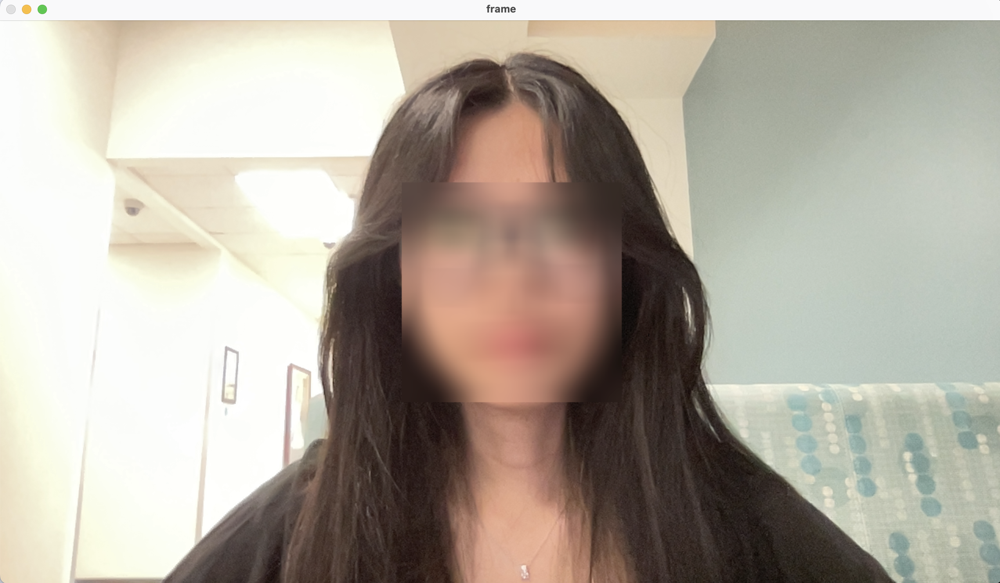

#Face Guard

Face Guard was my first experience working with OpenCV, where I followed a tutorial to implement face detection using MediaPipe and OpenCV. The project focuses on ensuring accurate and consistent face blurring across various media, including photos, videos, and live webcam feeds. Through this process, I gained hands-on experience with computer vision techniques, such as facial landmark detection and real-time image processing.

Working on this project introduced me to the fundamentals of handling video streams, integrating machine learning models for face detection, and applying transformations to anonymize sensitive information. It also deepened my understanding of OpenCV’s powerful image processing capabilities and MediaPipe’s ease of use for real-time applications. This project sparked my interest in privacy-focused technology and provided a strong foundation for future work in computer vision and interactive applications. 

{ width="400" }

<video width="400" controls>
  <source src="/assets/blurVid.mov" type="video/mp4">
  Your browser does not support the video tag.
</video>

