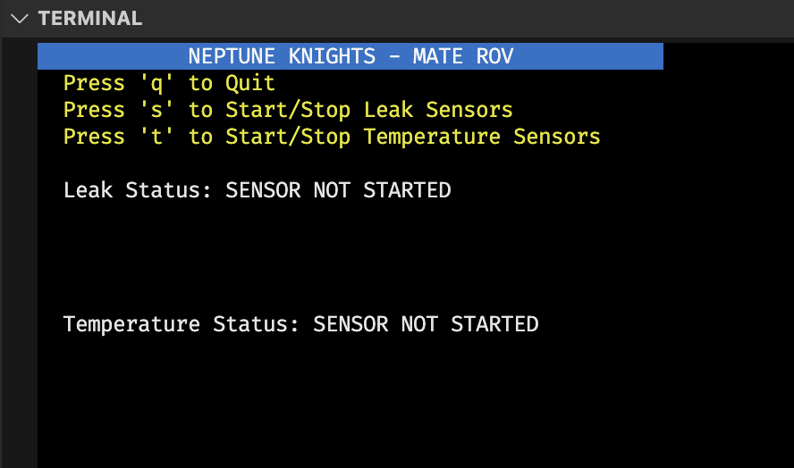
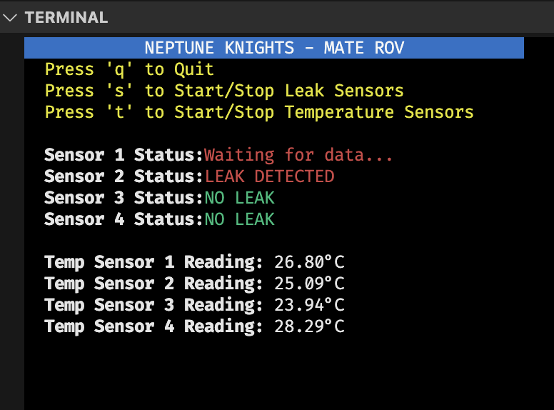

#MATE ROV

In this project, I developed and coded a leak sensor to detect water leakage in the MATE ROV’s enclosure, enhancing underwater safety and durability by providing real-time alerts to the system. Additionally, I created a terminal user interface using PySerial and the curses library to display both leak sensor and temperature information on the flight control system, ensuring clear and immediate feedback for operators. This project deepened my understanding of sensor integration, serial communication, and building intuitive user interfaces for real-time monitoring.

{ width="400" }
{ width="400" }
