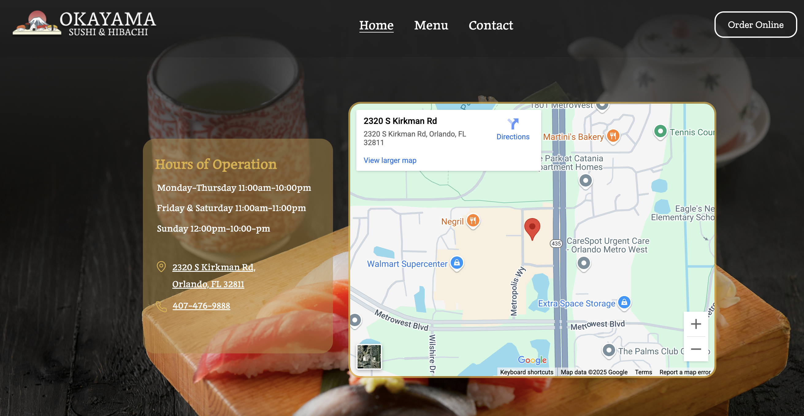

#Okayama

I built a website for a sushi restaurant called Okayama using HTML, CSS, and JavaScript. The project involved designing a clean, user-friendly interface to showcase the restaurant’s menu, atmosphere, and contact information. I focused on creating a user friendly layout, smooth navigation, and interactive elements to enhance the user experience. This project allowed me to apply my front-end development skills while crafting a digital presence that reflects the restaurant’s unique identity.

{ width="500" }
{ width="500" }
{ width="500" }
