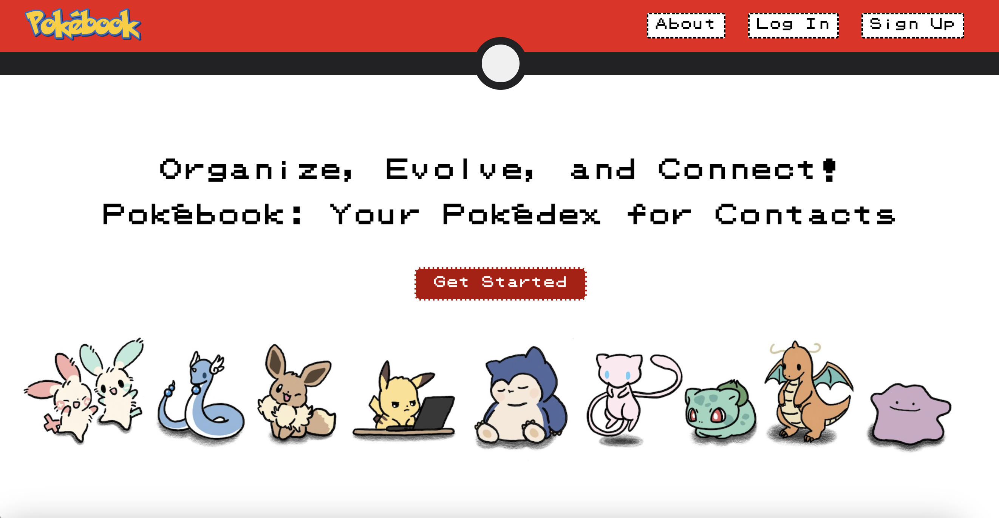

#Pokébook

Pokébook is a full-stack web application designed as a Pokémon-themed contact manager, allowing users to create, read, update, and delete (CRUD) contacts. The web app features a playful, Pokémon-inspired UI, making contact management more engaging. Users can store, organizeand manage thier contacts. This project combines front-end and back-end technologies to deliver a seamless and interactive experience. I worked on this group with a team of 4 other people. I focused on the front-end development where I used HTML, CSS, and JavaScript

{ width="500" }
{ width="500" }
